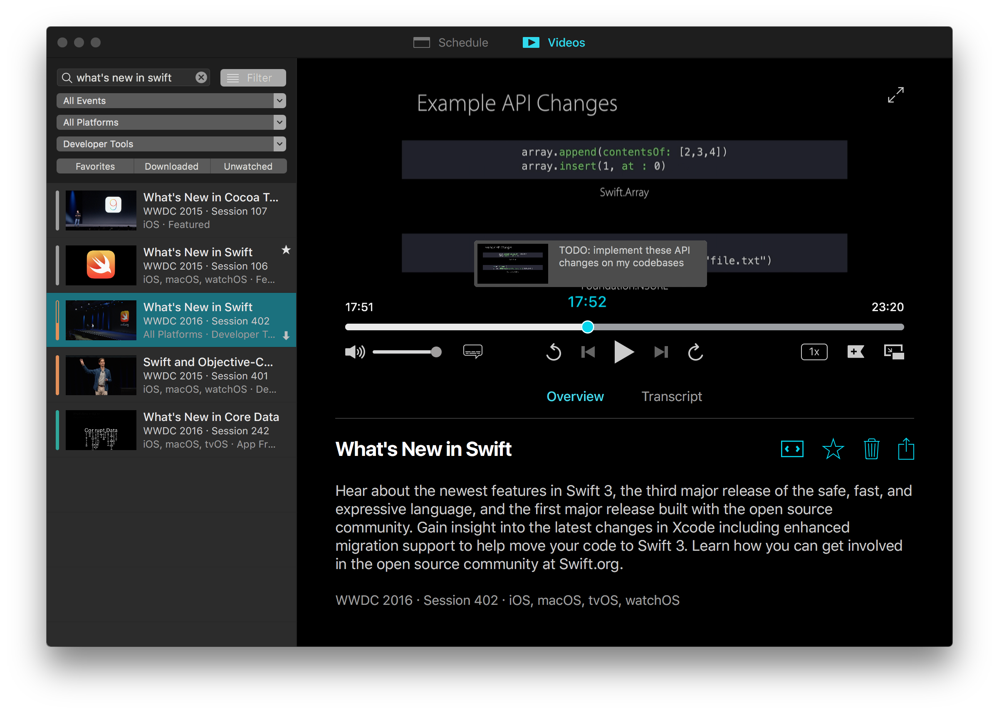

# The unofficial WWDC app for macOS

⬇️ If you just want to download the latest release, go to [the website](https://wwdc.io).

## Schedule

The schedule tab shows the schedule for the current edition of the event, and this is where you can watch the live stream for the Keynote and other sessions.

## Videos

Watch this year's videos as they're released and also videos from previous editions. With [ASCIIWWDC](http://asciiwwdc.com) integration, you can also read transcripts of the sessions and easily jump to specific points in the videos.

### Video features

- Watch video in 0.5x, 1x, 1.5x or 2x speeds
- Fullscreen and native picture in picture support
- Navigate video contents easily with the help of transcripts

## Bookmarks

Have you ever found yourself watching a WWDC video and wanting to take notes related to a specific time in the video so you can refer back to it later on? This is what you can do with bookmarks.

With bookmarks, you can create a reference point within a video and add an annotation to it. Your bookmark annotations can also be considered while using the search, so it's easier to find content you've bookmarked before.

## Sharing

You can easily share links to sessions or videos by using the share button. The links shared are for Apple's developer website, but the app can open these links if you drag them into the icon (or if you use [BrowserFreedom](https://getbrowserfreedom.com)).

## *COMING SOON:* Syncing and bookmark sharing

With the current version of the app you can already setup your account (if you have iCloud set up). Your account will be used in future versions to sync your favorites and bookmarks accross your Macs and to share your bookmarks with other users of the app.

## *COMING SOON:* AirPlay and ChromeCast support

In a future update, AirPlay and ChromeCast support will be added so you can stream session videos to your AirPlay ® or GoogleCast ® enabled devices.

## Nerdy bits 🤓

### External libraries

This is the list of libraries used by the app:

- [Realm](https://realm.io): data storage and caching
- [Sparkle](https://sparkle-project.org/): automatic updates
- [Fabric](https://fabric.io): crash reporting and error logging
- [Siesta](http://bustoutsolutions.github.io/siesta/): networking
- [SwiftyJSON](https://github.com/SwiftyJSON/SwiftyJSON): JSON parsing
- [RxSwift](https://github.com/ReactiveX/RxSwift): reactive extensions
- [RxRealm](https://github.com/RxSwiftCommunity/RxRealm): reactive extensions for Realm

### Internal libraries

- **ConfCore** is the core of the app that deals with Apple's WWDC API, data storage, caching, syncing and transcripts (everything that has to do with data, basically)
- **PlayerUI** contains the UI components for the video player and some general-purpose UI components used throughout the app
- **ThrowBack** provides support for migration of user data and preferences from old versions of the app
- **CommunitySupport** manages your account information with iCloud and will be used for the bookmark sharing functionality in the future

## Building the app

Building the app requires [Carthage](https://github.com/Carthage/Carthage) to be installed.

**Clone this branch and before opening the project, run `./bootstrap.sh`** to fetch the dependencies (this script can take a while to run, that's normal).

Since the app uses CloudKit, when you build it yourself, all of the CloudKit-dependant functionality will not be available. CloudKit requires a provisioning profile and a paid developer account.

To build the app yourself without the need for a developer account and a CloudKit container, **always use the `WWDC` target when building**. The `WWDC with iCloud` target requires a paid developer account and a CloudKit container, which you won't be able to create because of the app's bundle identifier.

### Clearing app data during development

If you need to clear the app's preferences and stored data during development, you can run `./cleardata.sh` in the project folder. **This will delete all of your preferences and data like favorites, bookmarks and progress in videos, so be careful**.