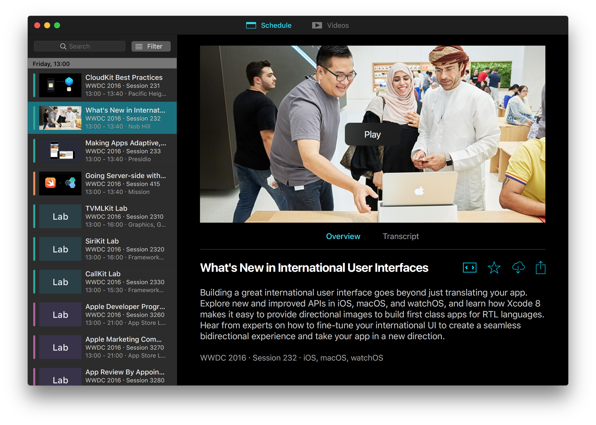
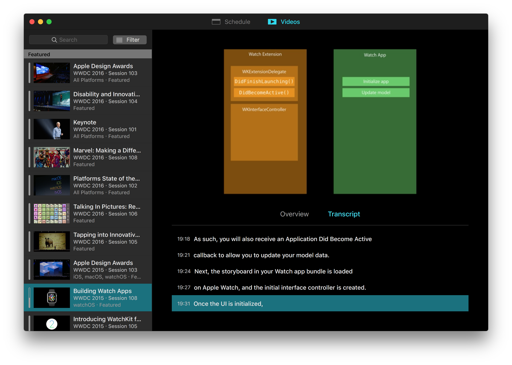
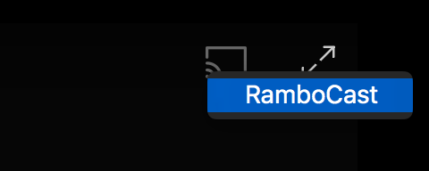

# The unofficial WWDC app for macOS

WWDC for macOS allows both attendees and non-attendees to access WWDC livestreams, videos and sessions during the conference and as a year-round resource.

⬇️ If you just want to download the latest release, go to [the website](https://wwdc.io).

## Schedule

The schedule tab shows the schedule for the most recent WWDC, and allows you to watch live streams for the Keynote and other sessions throughout the week.

## Videos

Watch this year's videos as they're released and access videos from previous years. With [ASCIIWWDC](http://asciiwwdc.com) integration, you can also read transcripts of sessions and easily jump to a specific point in the relevant video.

### Video features

- Watch videos in 0.5x, 1x, 1.5x or 2x speeds
- Fullscreen and native picture-in-picture support
- Navigate video contents easily with the help of transcripts

## ChromeCast

You can watch WWDC videos (both live and on-demand) on your ChromeCast. Just click the ChromeCast button while playing a video, choose your device from the list and control playback using the Google Home app on your phone.

## Bookmarks

Have you ever found yourself watching a WWDC session and wishing you could take notes at a specific point in the video to refer back to later on? This is now possible with bookmarks.

With bookmarks, you can create a reference point within a video and add an annotation to it. Your bookmark annotations can also be considered while using the search, so it's easier than ever to find the content you've bookmarked before.

## Sharing

You can easily share links to sessions or videos by using the share button. The links shared are for Apple's developer website, but the app can open these links if you drag them into the icon (or if you use [BrowserFreedom](https://getbrowserfreedom.com)).

## *COMING SOON:* Syncing and bookmark sharing

With the latest version of the app you can already begin creating an account (if you have iCloud set up on your device). In future versions, your account will be used to sync your favorites and bookmarks across your Macs and to share your bookmarks with other users of the app.

## Nerdy bits 🤓

### External libraries

A number of third-party libraries are used by the app:

- [Realm](https://realm.io): data storage and caching
- [Sparkle](https://sparkle-project.org/): automatic updates
- [Fabric](https://fabric.io): crash reporting and error logging
- [Siesta](http://bustoutsolutions.github.io/siesta/): networking
- [SwiftyJSON](https://github.com/SwiftyJSON/SwiftyJSON): JSON parsing
- [RxSwift](https://github.com/ReactiveX/RxSwift): reactive extensions
- [RxRealm](https://github.com/RxSwiftCommunity/RxRealm): reactive extensions for Realm

### Internal libraries

- **ConfCore** is the core of the app that deals with Apple's WWDC API, data storage, caching, syncing and transcripts (everything that has to do with data, basically)
- **PlayerUI** contains the UI components for the video player and some general-purpose UI components used throughout the app
- **ThrowBack** provides support for migration of user data and preferences from old versions of the app
- **CommunitySupport** manages your account information with iCloud and will be used for the bookmark sharing functionality in the future

## Building the app

Building the app requires [Carthage](https://github.com/Carthage/Carthage) to be installed.

**Clone this branch and before opening the project, run `./bootstrap.sh`** to fetch the dependencies (this script can take a while to run, that's normal).

Since the app uses CloudKit, when you build it yourself, all of the CloudKit-dependant functionality will not be available. CloudKit requires a provisioning profile and a paid developer account.

To build the app yourself without the need for a developer account and a CloudKit container, **always use the `WWDC` target when building**. The `WWDC with iCloud` target requires a paid developer account and a CloudKit container, which you won't be able to create because of the app's bundle identifier.

### Clearing app data during development

If you need to clear the app's preferences and stored data during development, you can run `./cleardata.sh` in the project folder. **This will delete all of your preferences and data like favorites, bookmarks and progress in videos, so be careful**.